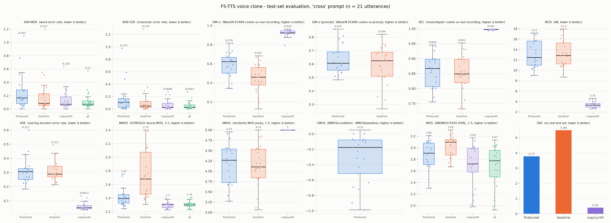
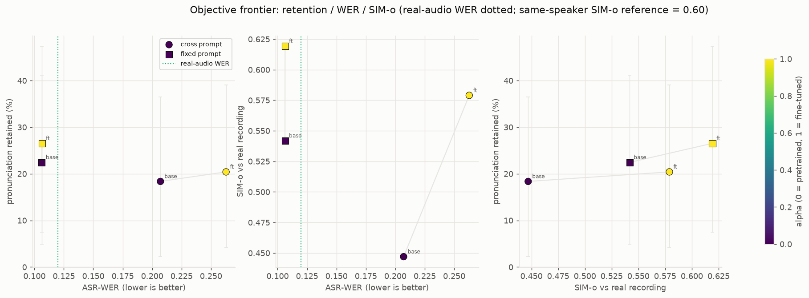

# aktts — single-speaker voice cloning with F5-TTS

Fine-tunes [F5-TTS](https://github.com/SWivid/F5-TTS) (`F5TTS_Base`, 337 M-parameter DiT +
conditional flow matching) on ~67 minutes of one speaker, with the specific goal of reproducing
**how he pronounces words** — his accent and idiosyncratic realisations — rather than letting the
pretrained model normalise them to standard English.

Built and run on a single RTX 3080 Ti (12 GB), Ubuntu 24.04, Python 3.12, torch 2.7.1+cu118.

| | |
|---|---|
| Live demo | **[huggingface.co/spaces/Rezuwan/Aktar_Khan_TTS](https://huggingface.co/spaces/Rezuwan/Aktar_Khan_TTS)** |
| Weights | **[huggingface.co/Rezuwan/AktarKhan_Weights](https://huggingface.co/Rezuwan/AktarKhan_Weights)** (`alpha_1.0`, `alpha_1.2`) |
| Evidence | [`checkpoints/evaluation_report.md`](checkpoints/evaluation_report.md) |

---

## ⚠️ This is a clone of a real person's voice

The model reproduces the voice of a specific, identifiable individual. Everything below assumes
that is understood:

- **Scope of consent matters, and it is not transitive.** Consent to record audio, or to train a
  model, is not the same as consent to a publicly reachable endpoint that will say anything anyone
  types. Decide those separately.
- **The training audio is deliberately not in this repository.** See
  [What is and isn't in this repo](#what-is-and-isnt-in-this-repo). Publishing source recordings
  next to a working clone of the same voice makes impersonation materially easier.
- **If you reuse this pipeline on another speaker**, get explicit, informed, written permission for
  the specific uses you intend — including public deployment if that's the plan — and disclose
  AI-generated audio wherever it's published. Gating the demo, restricting it to fixed sentences,
  or keeping it private are all reasonable defaults.

---

## Pipeline

Four scripts, run in order. Each is independently re-runnable and caches its work.

```
scripts/build_clean_dataset.py   raw recordings + transcripts -> denoised, deduplicated, split dataset
scripts/finetune_tts.py          fine-tune F5TTS_Base on the speaker -> checkpoints/best_model.pt
scripts/evaluation.py            full metric suite + phone-level retention -> evaluation_report.md
scripts/inference.py             clone a voice for arbitrary text -> output/generated_audio/
```

`scripts/common.py` holds everything shared: paths, logging, ffmpeg discovery, audio I/O, forced
alignment, and the pre-run disk sweep (`common.cleanup_cache`).

**Every entry point runs the disk sweep at startup** and refuses to begin if space is short
(training gates at 15 GB, evaluation at 5 GB, inference at 2 GB). `--skip_cleanup` opts out. It
only removes regenerable junk — `*.tmp`, `__pycache__`, incomplete evaluation conditions — lists
everything before deleting it, and never touches source audio, the checkpoint, or `logs/run*/`
archives.

### Setup

```bash
python3.12 -m venv aktts
source aktts/bin/activate            # note: source it, do not execute it
pip install -r requirements.txt
sudo apt install ffmpeg              # required by build_clean_dataset.py and inference.py
```

### Running it

```bash
# 1. dataset (needs raw_data/ + transcriptions.csv, neither of which ships here)
python scripts/build_clean_dataset.py
python scripts/build_clean_dataset.py --skip_separation   # reuse data/clean_audios/, redo dedup+split

# 2. training — 60 planned epochs, auto-extends while val loss still falls, early stop at 20
python scripts/finetune_tts.py
python scripts/finetune_tts.py --dry_run    # 1 epoch on 4 clips, VRAM check; writes nothing
python scripts/finetune_tts.py --resume     # continue from checkpoints/last_model.pt

# 3. evaluation — both prompt modes, full metric suite, phone-level retention
python scripts/evaluation.py
python scripts/evaluation.py --phone_seeds 3       # pool 3 synthesis seeds (see Reliability)
python scripts/evaluation.py --alphas 0,0.4,1,1.2  # sweep weight interpolation

# 4. inference
python scripts/inference.py
python scripts/inference.py --gen_text "Your sentence here." --nfe_step 32 --seed 7
```

---

## Results

Checkpoint: epoch 91, validation loss 0.8913. Test set: 21 held-out utterances.
Full tables in [`checkpoints/evaluation_report.md`](checkpoints/evaluation_report.md).



### The recordings, not the model, bound naturalness

| metric | real audio | copy-synthesis (mel→vocos) | baseline / fixed | finetuned / fixed |
|---|---:|---:|---:|---:|
| NMOS ↑ | 1.305 | **1.296** | 1.932 | 1.568 |
| MOS ↑ | 2.673 | **2.692** | 3.093 | 3.044 |
| ASR-WER ↓ | 0.120 | 0.138 | 0.106 | **0.106** |

Copy-synthesis — the real audio passed through mel → vocos, the best any model in this pipeline
could possibly do — scores **at or below the real recordings** on NMOS/MOS. The recordings
themselves cap these scores. The pretrained baseline scoring *higher* than real audio on NMOS
(1.932 vs 1.305) is therefore not the baseline being better; it's the baseline producing cleaner,
flatter, less characterful speech than the source material. **Do not read NMOS as "quality" here.**

Fine-tuned WER on the fixed prompt (0.106) matches the real speaker's own WER (0.120) — the clone
is as intelligible as the person.

### SIM-o has a ceiling, and the model is at it

Two *different real recordings of the same speaker* score SIM-o **0.603** (n=210, range
0.327–0.930). Different speakers score 0.029. So 0.603 — not 1.0 — is what a perfect clone should
target. The fine-tuned model scores **0.619** on the fixed prompt, i.e. already at/above the
same-speaker distribution. There is no speaker-identity headroom left; guard this metric, don't
optimise it.

### Pronunciation retention, measured at the phone level

The original retention metric was an ASR proxy — "Whisper mis-hears a word on the real audio, does
it mis-hear the clone the same way". It found only 49 markers and fired on Whisper's own lexical
priors (`suleiman`→`sullivan`), morphology (`ranking`→`ranked`) and tokenisation
(`post`→`postgraduate`). Three evaluations of statistically identical checkpoints swung 14.3 % →
26.5 % → 32.7 % on it. **It was measurement noise, not model change.**

The primary metric now measures the phones directly: force-align both recordings to the verbatim
transcript, read realised phones out of each word span with a CTC phone recogniser, and compare by
phone edit distance. A marker is a word where the **speaker** and the **zero-shot pretrained
model** differ by ≥ 0.70 PER — so homophones, inflection and tokenisation splits are excluded *by
construction*, since those produce near-identical phone strings. The threshold is calibrated
against a copy-synthesis noise floor (3.1 % false markers vs 34.4 % yield, 10.9× separation).

**SPD** = mean phone distance from a condition to the speaker. It never references the prior, so
unlike `retained %` it can't be inflated by a condition merely drifting away from the pretrained
model.

`fixed` prompt, 209 markers (up from 49):

| condition | SPD ↓ | 95 % CI | % of the way to the speaker | ΔSPD vs baseline |
|---|---:|---|---:|---|
| copy-synthesis (ceiling) | 0.253 | [0.210, 0.316] | 100 % | −0.607 [−0.649, −0.545] * |
| **finetuned** | **0.712** | [0.651, 0.772] | **24.7 %** | **−0.149 [−0.206, −0.093]** * |
| zero-shot baseline (floor) | 0.862 | [0.848, 0.875] | 0 % | — |

`* CI excludes zero.` The fine-tune closes a statistically solid ~25 % of the gap between the
pretrained prior and the speaker. It is not close to the copy-synthesis ceiling — there is real
headroom left on pronunciation, which is the honest summary of where this project got to.

The speaker's actual phonology, from the whole-dataset lexicon (1,311 word types, 8,243 tokens):
`the`→`d a` (th-stopping), `very`→`b e r i` and `university`→`i n i b a r s i t i` (v→b),
`of`→`a p` (final devoicing).

### Reliability — read this before trusting any retention number

The metric was validated against an identity test: **the same weights, synthesised twice.**

| statistic | same weights, two syntheses (`fixed`) | verdict |
|---|---|---|
| `retained %` | 24.4 % vs 14.4 % — paired CI [+1.0, +20.6], **excludes zero** | fails — declares identical weights different |
| `SPD` | 0.713 vs 0.748 — paired CI contains zero | passes |

Pooled over ≥ 3 synthesis seeds, two *independent training runs* (epoch 81 vs epoch 91) agree to
1.9–4.7 pp on both statistics, CIs containing zero. So: **pool ≥ 3 seeds (`--phone_seeds 3`) for
any comparison that decides something, and prefer SPD.** Single-seed `retained %` is indicative
only. Dominance testing is CI-aware on the retention axis for the same reason — a point-estimate
deficit inside the noise band is not evidence.

### Operating point: α = 1.0 recommended

Weight interpolation θ(α) = (1−α)·θ_pretrained + α·θ_finetuned is the **only** lever that moved
retention materially. Seed-pooled, CI-aware, `fixed` prompt:

| α | SPD ↓ | % to speaker | WER ↓ | SIM-o ↑ |
|---|---:|---:|---:|---:|
| 0.0 (baseline) | 0.862 | 2 % | 0.106 | 0.542 |
| 0.8 | 0.783 | 15 % | 0.124 | 0.611 |
| **1.0 (shipped)** | **0.745** | **21 %** | **0.120** | **0.615** |
| 1.2 | 0.688 | 30 % | 0.196 | 0.637 |
| 1.5 | 0.608 | 42 % | 0.238 | 0.657 |

**Nothing dominates α = 1.0 on the fixed prompt** — it's a genuine trade-off. α = 1.2 buys
significant retention (ΔSPD −0.056, CI excludes zero) at a significant WER cost (+0.076, CI
excludes zero). **α = 1.0 is the default** because its WER matches the real speaker's, and SIM-o is
already at the same-speaker ceiling so the extra similarity at higher α buys nothing real. α = 1.2
ships alongside it for anyone who wants accent fidelity over intelligibility.



### Decoding: keep the defaults

A 60-point grid (CFG ∈ {1.0, 1.3, 1.6, 2.0, 2.5} × NFE ∈ {32, 64} × sway ∈ {−1.0, 0.0} × α ∈ {0.4,
1.0, 1.2}, 3 seeds each) found **no configuration that beats the defaults significantly.** α's
effect on SPD (0.12–0.16) is 5–50× larger than anything CFG, NFE or sway produce (≤ 0.023). The
best grid cell was statistically indistinguishable from plain defaults at the same α
(ΔSPD −0.038, CI [−0.073, +0.001]).

**Recommended: CFG = 2.0, NFE = 32, sway = −1.0** — the F5-TTS defaults. NFE = 64 doubles inference
cost for nothing measurable.

Use the **fixed** enrolment prompt, not cross-prompt: it wins on every axis (WER 0.106 vs 0.263,
SIM-o 0.619 vs 0.579).

---

## Caveats

**Four test utterances behave badly, and the causes differ.** Diagnosed from per-utterance ASR on
the real audio vs the clone:

| utt | real-audio WER | clone `cross` | clone `fixed` | diagnosis |
|---|---:|---:|---:|---|
| 103 | **0.576** | 0.545 (CER 0.061) | 0.364 | **WER artifact, not a defect.** `IShowSpeed` is one transcript token; Whisper writes "I show speed" — one word-error × 6 occurrences. CER stays 0.06–0.18. The clone's CER is *better* than Whisper's read of the real recording. |
| 13 | 0.087 | 0.522 | **0.043** | **Ambiguous source recording.** Whisper hears "cry like others" for "cry like a baby"; the dedup step independently transcribed the near-duplicate clip as "cry like Adam … play Tiza". Genuinely unclear audio. |
| 107 | **0.000** | 1.100 | 0.400 | **Model failure on a clean recording.** Cross-prompt output leaked another utterance's content ("ice speed are very speed"). Shortest clip (8.2 s). |
| 117 | 0.039 | 0.745 | 0.098 | **Model failure on a clean recording.** Cross-prompt output starts mid-sentence, skipping the opening. Longest text (~300 chars). |

**None of these were patched.** All 21 test utterances are present and unmodified in
`data/splits/test.csv` — the test set is intact and the reported numbers include these four. Two
are cross-prompt-only failures on clean audio, one is a metric artifact, one is a genuinely
ambiguous recording. All four are dramatically better on the `fixed` prompt, which is the mode
this project recommends.

**The default inference reference prompt was changed** because it had originally been auto-selected
as test clip 13 — the ambiguous recording above — purely for being the longest clip under the 12 s
cap, with no quality check. It now uses a DNSMOS-selected clip from the held-out validation split.
Any audio generated before 2026-09-27 used the worse reference.

**Naturalness metrics (NMOS/DNSMOS/UTMOS) are not usable as quality scores here**, per the
copy-synthesis ceiling above.

**Retention has real headroom.** 24.7 % of the way from the prior to the speaker is a solid,
statistically confirmed gain, but far from the 100 % that copy-synthesis shows is acoustically
reachable.

---

## What is and isn't in this repo

**Tracked** (~1.9 MB total): the five scripts, this README, `requirements.txt`, the evaluation
evidence (`evaluation_report.md`, `evaluation_results.csv`/`.json`, `evaluation_metrics.png`,
`evaluation_frontier.png`), the split manifests and dedup provenance (`data/splits/*.csv`,
`dataset_report.json` — transcripts and durations, no audio), and the canonical training curve
(`logs/training_convergence.png`, `training_metrics.csv`/`.xlsx`, `train_config.json`).

**Excluded** — see [`.gitignore`](.gitignore). Two of these are deliberate decisions rather than
housekeeping:

- **The speaker's audio** (`data/splits/*/`, `data/clean_audios/`, `raw_data/`,
  `transcriptions.csv`) is excluded *because* it is recordings of an identifiable person, not
  merely because it's large. Distributing it next to a working clone of the same voice is a consent
  decision for the speaker to make — if it should be available, do that deliberately and with
  gating, not as a side effect of a commit.
- **Trained weights** (`checkpoints/*.pt`, ~0.6–1.9 GB) live at
  [Rezuwan/AktarKhan_Weights](https://huggingface.co/Rezuwan/AktarKhan_Weights) instead. The repo
  points there rather than carrying a copy.

Also excluded: generated audio and evaluation sweeps (`output/`, tens of GB, regenerable from the
checkpoint), per-run log archives (`logs/run*/`), the venv, and caches.


## Model Deployment

The final model weights were deployed in HuggingFace Spaces. The implementation can be found in deployment [here](https://huggingface.co/spaces/Rezuwan/Aktar_Khan_TTS)


 


## License

The base model [SWivid/F5-TTS](https://github.com/SWivid/F5-TTS) is released under **CC-BY-NC-4.0**
(non-commercial). A fine-tune inherits that restriction — check it before any commercial use.

> **Note:** the weights repo on Hugging Face currently declares `license: mit`, which is
> inconsistent with the CC-BY-NC-4.0 base model. That needs correcting on the HF side.
